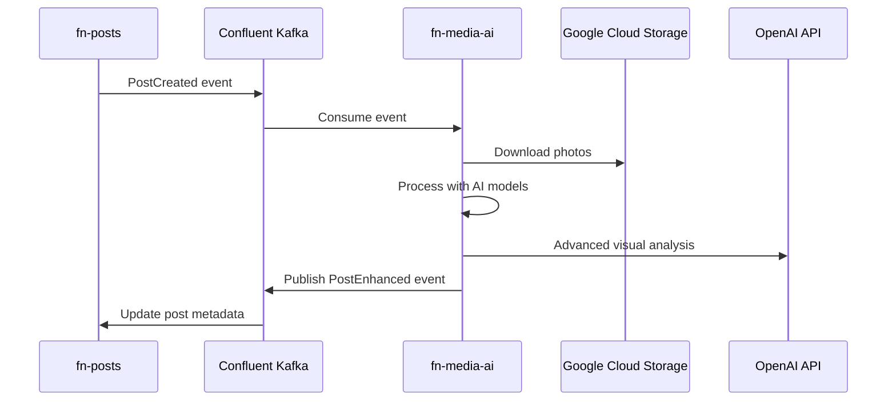

# FN Media AI - Lost & Found Photo Enhancement Service

**Document Ownership**: This document OWNS Media AI domain specifications, computer vision pipeline, AI model integration, and GKE deployment with GPU support.

**AI-powered photo analysis with fat events and privacy-first design that transforms Lost & Found posts into rich, searchable metadata through computer vision and machine learning.**

## Overview

The FN Media AI service is a critical component of the Findly Now Lost & Found ecosystem. It processes uploaded photos using advanced AI models to automatically extract meaningful metadata, generate descriptive tags, and enhance post discoverability - dramatically improving the chances of reuniting people with their lost items. The service is designed for deployment on Google Kubernetes Engine (GKE) with optional GPU acceleration for production workloads.

## Core Mission

Transform photo-based Lost & Found reports from manual text descriptions to **intelligent, AI-powered discovery** through automated visual analysis.

## Key Architectural Features

🔄 **Events**: Self-contained events with complete context eliminate cross-service dependencies
🔒 **Privacy-First**: Zero PII in event streams, secure photo processing pipeline
🏛️ **Database Isolation**: Complete data sovereignty with domain-specific `media_ai_db` database
⚡ **Performance**: <3 second photo processing with parallel AI model inference

**Business Impact:**
- 🔍 **Enhanced Discovery**: AI-generated tags make items easier to find
- 🚀 **Improved Matching**: Computer vision identifies visual similarities
- ⚡ **Faster Reunification**: Rich metadata enables intelligent search via fat events
- 🎯 **Higher Success Rates**: Better descriptions lead to more successful matches

## Architecture

This service follows **Domain-Driven Design (DDD)** principles with clean architecture:

```
src/fn_media_ai/
├── domain/           # Business logic & entities
│   ├── entities/     # PhotoAnalysis, ObjectDetection
│   ├── aggregates/   # PhotoAnalysisAggregate
│   ├── value_objects/# Confidence, BoundingBox, Tags
│   └── services/     # AIModelPipeline, ConfidenceEvaluator
├── application/      # Use cases & orchestration
│   ├── services/     # ProcessPhotoService
│   ├── commands/     # ProcessPhotoCommand
│   └── event_handlers/ # PostCreatedEventHandler
├── infrastructure/   # External integrations
│   ├── adapters/     # OpenAI, Hugging Face, GCS
│   ├── repositories/ # PhotoAnalysisRepository
│   └── clients/      # HTTP clients
└── web/             # FastAPI endpoints
    ├── controllers/  # REST API controllers
    └── middleware/   # Authentication, logging
```

## Key Features

### 🤖 Multi-Model AI Pipeline

- **Object Detection**: YOLO models identify items, brands, accessories
- **Scene Classification**: ResNet/EfficientNet detect location context
- **OCR Text Extraction**: Tesseract/EasyOCR extract visible text, serial numbers
- **Location Inference**: GPT-4 Vision provides landmark detection and context
- **Smart Description**: AI-generated enhanced descriptions

### 🎯 Confidence-Based Enhancement

All AI predictions include confidence scores with intelligent thresholding:

- **Auto-enhance** (>85%): Automatically update post metadata
- **Suggest tags** (>70%): Recommend tags for user approval
- **Human review** (>50%): Flag for manual verification
- **Discard** (<30%): Ignore low-confidence results

### ⚡ Event-Driven Processing

**Event Consumption**: All events include complete context to eliminate API dependencies:

```json
{
  "event_type": "post.created",
  "payload": {
    "post": {
      "id": "post-123",
      "title": "Lost iPhone 15 Pro",
      "photos": [{"id": "photo-456", "url": "gs://bucket/photo1.jpg"}],
      "user": {
        "id": "user-789",
        "display_name": "John D.",
        "organization_id": "org-101"
      },
      "organization": {
        "settings": {"ai_processing": true, "auto_enhance": true}
      }
    }
  }
}
```

**Event Publishing**: Enhanced events include all AI results for downstream processing:

```json
{
  "event_type": "post.enhanced",
  "payload": {
    "post_id": "post-123",
    "ai_analysis": {
      "objects": [
        {"name": "smartphone", "confidence": 0.95, "brand": "Apple"},
        {"name": "phone_case", "confidence": 0.88, "color": "blue"}
      ],
      "scene": {"type": "indoor", "confidence": 0.92},
      "text_extracted": ["iPhone", "Pro Max", "A2484"],
      "colors": [{"name": "black", "hex": "#000000", "dominant": true}],
      "generated_tags": ["electronics", "mobile", "smartphone", "apple", "iphone"],
      "enhanced_description": "Black Apple iPhone 15 Pro with blue protective case"
    },
    "processing_metadata": {
      "model_versions": {"yolo": "v8.2", "gpt4v": "2024-01"},
      "processing_time_ms": 2847,
      "confidence_scores": {"overall": 0.91}
    }
  }
}
```

**Key Benefits**:
- **No API Dependencies**: Complete context in events eliminates service calls
- **Parallel Processing**: Multiple photos processed concurrently (2-3 seconds total)
- **Privacy Protection**: No PII in events, secure photo access via GCS URLs
- **Non-blocking**: Users continue using platform while AI processes

### 🏗️ Production-Ready Infrastructure

- **Horizontal Scaling**: Stateless design enables easy replication
- **Model Optimization**: Quantization, batching, optimized inference
- **Caching Strategy**: Redis for AI results and model weights
- **Health Monitoring**: Comprehensive health checks and metrics

## Database Isolation & Privacy

### Domain-Specific Database: `media_ai_db`
- **AI Processing Metadata**: Analysis results, confidence scores, model versions
- **Processing Cache**: Temporary storage for optimization (TTL-based cleanup)
- **Privacy Protection**: No PII storage, only post IDs and analysis results
- **Performance Optimized**: Indexes for post_id lookups and confidence filtering

### Privacy-First Design
- **No PII in Database**: Only stores post IDs and AI analysis results
- **Secure Photo Access**: GCS URLs with time-limited signed access
- **Event Privacy**: Contact information never processed or stored
- **Audit Compliance**: Processing logs for model traceability without user data

## Technology Stack

### Core Framework
- **FastAPI + Uvicorn**: Async web server with automatic OpenAPI docs
- **Pydantic**: Type validation and settings management

### AI/ML Libraries
- **PyTorch + Transformers**: Deep learning and Hugging Face models
- **OpenAI**: GPT-4 Vision API for advanced visual reasoning
- **OpenCV + Pillow**: Computer vision and image processing
- **Ultralytics (YOLO)**: State-of-the-art object detection
- **Tesseract + EasyOCR**: Optical character recognition

### Infrastructure
- **Confluent Kafka**: Event streaming and processing
- **Google Cloud Storage**: Photo access and storage
- **Redis**: Model caching and result storage
- **Prometheus**: Metrics and monitoring

## Quick Start

### Prerequisites for Local Development

- Python 3.11+
- Redis server
- Google Cloud Storage access
- OpenAI API key (for GPT-4 Vision)
- Confluent Cloud Kafka access
- Docker (for containerized development)
- 8GB+ RAM (16GB recommended for model loading)
- NVIDIA GPU (optional, for accelerated inference)

### Prerequisites for GKE Deployment

#### Core Requirements
- GKE Autopilot or Standard cluster
- Google Cloud Project with billing enabled
- gcloud CLI configured
- kubectl configured for cluster access
- Helm 3.x installed

#### GPU Support (Production)
- GKE GPU node pool with NVIDIA T4 or A100 GPUs
- NVIDIA device drivers installed via DaemonSet
- GPU quota approved in GCP project
- Sufficient GPU allocation quota (1-4 GPUs recommended)

#### Storage Requirements
- 50GB+ persistent volume for model storage
- SSD storage class for optimal model loading
- ReadWriteMany access for multi-node deployments

#### Monitoring Stack
- Prometheus Operator installed
- Grafana for visualization (optional)
- Google Cloud Monitoring enabled

### Installation

```bash
# Clone repository
git clone https://github.com/findly-now/fn-media-ai.git
cd fn-media-ai

# Create virtual environment
python -m venv .venv
source .venv/bin/activate  # On Windows: .venv\Scripts\activate

# Install dependencies
pip install -e ".[dev]"

# Install pre-commit hooks
pre-commit install
```

### Configuration

```bash
# Copy environment template
cp .env.example .env

# Edit .env with your credentials
vim .env
```

### Environment Variables for AI Models & GPU

#### Development Environment
```bash
# Core Configuration
ENVIRONMENT=development
LOG_LEVEL=DEBUG
SERVER_WORKERS=2

# AI Model Configuration
MODEL_CACHE_DIR=/home/app/models/cache
TORCH_HOME=/home/app/models/cache
TRANSFORMERS_CACHE=/home/app/models/cache
HF_HOME=/home/app/models/cache
YOLO_MODEL_VERSION=yolov5s  # Lightweight for dev
RESNET_MODEL_VERSION=resnet-50
OCR_LANGUAGES=eng  # English only in dev

# GPU Configuration (Optional)
CUDA_VISIBLE_DEVICES=""  # Empty disables GPU
GPU_MEMORY_FRACTION=0.5  # Use 50% of GPU memory

# Model Processing
CONFIDENCE_THRESHOLD=0.5  # Lower for testing
BATCH_SIZE=5
MAX_CONCURRENT_REQUESTS=5
PROCESSING_TIMEOUT=60

# External Services
OPENAI_API_KEY=${OPENAI_API_KEY:-disabled}  # Optional in dev
HUGGINGFACE_API_KEY=${HF_API_KEY:-disabled}
GCS_BUCKET=fn-dev-posts-photos
KAFKA_BOOTSTRAP_SERVERS=kafka-dev:9092

# Caching
REDIS_HOST=localhost
REDIS_PORT=6379
CACHE_TTL=3600  # 1 hour in dev
MODEL_CACHE_ENABLED=false  # Disable for testing
```

#### Production Environment (GKE)
```bash
# Core Configuration
ENVIRONMENT=production
LOG_LEVEL=WARNING
SERVER_WORKERS=8

# AI Model Configuration
MODEL_CACHE_DIR=/models/cache
TORCH_HOME=/models/cache
TRANSFORMERS_CACHE=/models/cache
HF_HOME=/models/cache
YOLO_MODEL_VERSION=yolov5m  # Medium model for prod
RESNET_MODEL_VERSION=resnet-101  # Higher accuracy
OCR_LANGUAGES=eng,spa,fra  # Multi-language support

# GPU Configuration (Production)
CUDA_VISIBLE_DEVICES=0  # Use first GPU
NVIDIA_VISIBLE_DEVICES=all
NVIDIA_DRIVER_CAPABILITIES=compute,utility
GPU_MEMORY_FRACTION=0.9  # Use 90% of GPU memory
PYTORCH_CUDA_ALLOC_CONF=max_split_size_mb:512
TF_FORCE_GPU_ALLOW_GROWTH=true

# Model Processing (Optimized for GPU)
CONFIDENCE_THRESHOLD=0.85  # Higher for production
BATCH_SIZE=20  # Larger batches with GPU
MAX_CONCURRENT_REQUESTS=50
PROCESSING_TIMEOUT=30
MODEL_INFERENCE_TIMEOUT=10

# External Services (Production)
OPENAI_API_KEY=${OPENAI_API_KEY}  # Required
OPENAI_MODEL=gpt-4-vision-preview
OPENAI_MAX_TOKENS=1000
HUGGINGFACE_API_KEY=${HF_API_KEY}
GCS_BUCKET=findly-prod-posts-photos
KAFKA_BOOTSTRAP_SERVERS=${CONFLUENT_BOOTSTRAP_SERVERS}
KAFKA_SECURITY_PROTOCOL=SASL_SSL
KAFKA_SASL_MECHANISM=PLAIN

# Caching (Production)
REDIS_HOST=redis-prod.production.svc.cluster.local
REDIS_PORT=6379
REDIS_PASSWORD=${REDIS_PASSWORD}
CACHE_TTL=28800  # 8 hours
MODEL_CACHE_ENABLED=true
RESULT_CACHE_ENABLED=true

# Performance Tuning
OMP_NUM_THREADS=4  # OpenMP threads
MKL_NUM_THREADS=4  # Intel MKL threads
NUMEXPR_NUM_THREADS=4  # NumExpr threads
```

### Development

```bash
# Start Redis (if not running)
redis-server

# Run the service
uvicorn fn_media_ai.main:app --reload --host 0.0.0.0 --port 8000

# View API documentation
open http://localhost:8000/docs
```

### Testing

```bash
# Run E2E tests
pytest tests/e2e/ -v

# Run with coverage
pytest tests/e2e/ --cov=src/fn_media_ai --cov-report=html

# View coverage report
open htmlcov/index.html
```

## API Endpoints

### Health Check & Model Status

#### Basic Health Check
```bash
GET /health
```
Response:
```json
{
  "status": "healthy",
  "timestamp": "2024-01-15T10:30:00Z",
  "environment": "production",
  "version": "1.0.0"
}
```

#### Detailed Health with Model Loading Status
```bash
GET /health/detailed
```
Response:
```json
{
  "status": "healthy",
  "timestamp": "2024-01-15T10:30:00Z",
  "models": {
    "yolo": {
      "loaded": true,
      "version": "yolov5m",
      "load_time_ms": 2847,
      "memory_mb": 245,
      "device": "cuda:0"
    },
    "resnet": {
      "loaded": true,
      "version": "resnet-101",
      "load_time_ms": 1523,
      "memory_mb": 178,
      "device": "cuda:0"
    },
    "ocr": {
      "loaded": true,
      "engines": ["tesseract", "easyocr"],
      "languages": ["eng", "spa", "fra"],
      "memory_mb": 89
    },
    "gpt4v": {
      "available": true,
      "api_status": "connected",
      "rate_limit_remaining": 450
    }
  },
  "resources": {
    "cpu_percent": 45.2,
    "memory_percent": 72.8,
    "gpu_percent": 85.3,
    "gpu_memory_mb": 3842,
    "disk_usage_percent": 62.1
  },
  "dependencies": {
    "redis": "connected",
    "kafka": "connected",
    "gcs": "accessible",
    "openai": "reachable"
  }
}
```

#### Readiness Check
```bash
GET /ready
```
Returns 200 when all models are loaded and service is ready to process requests.

#### Liveness Check
```bash
GET /alive
```
Returns 200 if service is running (may still be loading models).

### Metrics Endpoint
```bash
GET /metrics
```
Prometheus-compatible metrics:
```prometheus
# HELP fn_media_ai_model_load_time_seconds Time to load AI models
# TYPE fn_media_ai_model_load_time_seconds histogram
fn_media_ai_model_load_time_seconds_bucket{model="yolo",le="1.0"} 0
fn_media_ai_model_load_time_seconds_bucket{model="yolo",le="5.0"} 1

# HELP fn_media_ai_inference_duration_seconds AI inference duration
# TYPE fn_media_ai_inference_duration_seconds histogram
fn_media_ai_inference_duration_seconds_bucket{model="yolo",le="0.1"} 145
fn_media_ai_inference_duration_seconds_bucket{model="yolo",le="0.5"} 298

# HELP fn_media_ai_gpu_memory_bytes GPU memory usage
# TYPE fn_media_ai_gpu_memory_bytes gauge
fn_media_ai_gpu_memory_bytes{device="0"} 4031848448

# HELP fn_media_ai_model_cache_hits_total Model cache hit count
# TYPE fn_media_ai_model_cache_hits_total counter
fn_media_ai_model_cache_hits_total{model="yolo"} 1523
```

### Photo Processing
- `POST /api/v1/photos/analyze` - Analyze single photo
- `POST /api/v1/posts/enhance` - Process post with multiple photos

### Model Management
- `GET /api/v1/models/status` - Current model loading status
- `POST /api/v1/models/reload` - Force reload AI models
- `POST /api/v1/models/preload` - Preload specific models
- `DELETE /api/v1/models/cache` - Clear model cache

## Event Processing Flow



## AI Processing Pipeline

```python
async def process_photo(photo_url: str) -> EnhancedMetadata:
    # Download and preprocess
    image = await download_photo(photo_url)

    # Parallel AI processing
    objects = await detect_objects(image)      # YOLO
    scene = await classify_scene(image)        # ResNet
    text = await extract_text(image)          # OCR
    location = await infer_location(image)     # GPT-4V

    # Combine results with confidence scoring
    return combine_analysis(objects, scene, text, location)
```

## Performance Targets

- **Processing Latency**: <5 seconds per photo (target: <3s)
- **Throughput**: 100+ concurrent photo analyses
- **Accuracy**: >85% object detection accuracy for common items
- **Availability**: 99.5% uptime (AI failures don't impact core platform)

## Development Guidelines

### Domain-Driven Design
- Keep business logic in domain entities and services
- Use aggregates to maintain consistency boundaries
- Infrastructure adapters implement domain interfaces
- Domain events for all state changes

### Testing Strategy
- **E2E tests only** - all tests use real adapters
- Test complete workflows with actual cloud services
- Include confidence scoring and error handling
- Test model fallback scenarios

### Code Quality
- **Type hints required** - full mypy compliance
- **Black formatting** - consistent code style
- **Minimal comments** - focus on complex business rules
- **Async/await** - for all I/O operations

## AI Model Performance Monitoring

### Key Performance Indicators (KPIs)

#### Model Inference Metrics
- **P50 Latency**: <500ms (with GPU), <2s (CPU only)
- **P95 Latency**: <2s (with GPU), <5s (CPU only)
- **P99 Latency**: <3s (with GPU), <10s (CPU only)
- **Throughput**: 50+ images/sec (GPU), 5+ images/sec (CPU)
- **GPU Utilization**: 70-90% during peak load
- **Model Load Time**: <30s for all models combined

#### Cache Performance
```bash
# Monitor Redis cache hit rates
redis-cli INFO stats | grep keyspace_hits

# Check model cache status
curl http://localhost:8000/api/v1/models/cache/stats
```

Response:
```json
{
  "cache_stats": {
    "model_cache": {
      "hits": 15234,
      "misses": 432,
      "hit_rate": 0.972,
      "memory_used_mb": 2048,
      "evictions": 12
    },
    "result_cache": {
      "hits": 8923,
      "misses": 1203,
      "hit_rate": 0.881,
      "ttl_seconds": 28800,
      "entries": 4521
    }
  },
  "performance": {
    "avg_cache_save_ms": 12,
    "avg_cache_load_ms": 3,
    "cache_benefit_ms": 2835  // Average time saved
  }
}
```

### Grafana Dashboard Configuration

Create custom dashboards for AI workload monitoring:

```json
{
  "dashboard": {
    "title": "FN Media AI Performance",
    "panels": [
      {
        "title": "Model Inference Latency",
        "targets": [
          {
            "expr": "histogram_quantile(0.95, fn_media_ai_inference_duration_seconds)",
            "legendFormat": "P95 Latency"
          }
        ]
      },
      {
        "title": "GPU Memory Usage",
        "targets": [
          {
            "expr": "fn_media_ai_gpu_memory_bytes / 1024 / 1024 / 1024",
            "legendFormat": "GPU Memory (GB)"
          }
        ]
      },
      {
        "title": "Model Cache Hit Rate",
        "targets": [
          {
            "expr": "rate(fn_media_ai_model_cache_hits_total[5m])",
            "legendFormat": "Cache Hit Rate"
          }
        ]
      }
    ]
  }
}
```

### Alerts Configuration

```yaml
# prometheus-alerts.yaml
groups:
  - name: fn_media_ai_alerts
    rules:
      - alert: HighModelInferenceLatency
        expr: histogram_quantile(0.95, fn_media_ai_inference_duration_seconds) > 5
        for: 5m
        annotations:
          summary: "Model inference taking too long"
          description: "P95 latency is {{ $value }}s (threshold: 5s)"

      - alert: GPUMemoryHigh
        expr: fn_media_ai_gpu_memory_bytes / fn_media_ai_gpu_memory_total > 0.9
        for: 10m
        annotations:
          summary: "GPU memory usage above 90%"

      - alert: ModelLoadFailure
        expr: fn_media_ai_model_load_failures_total > 0
        for: 1m
        annotations:
          summary: "Model failed to load"
          description: "Model {{ $labels.model }} failed to load"
```

## Monitoring & Observability

### Health Checks
```bash
# Basic health check
curl http://localhost:8000/health

# Detailed health with model status
curl http://localhost:8000/health/detailed

# Kubernetes probes
kubectl describe pod fn-media-ai-xxx | grep -A5 "Liveness\|Readiness"
```

### Metrics Collection
- **Prometheus**: Scrapes /metrics endpoint every 30s
- **Google Cloud Monitoring**: Native GKE metrics
- **Custom Metrics**: Model-specific performance data
- **Distributed Tracing**: OpenTelemetry integration

### Logging Strategy
Structured JSON logging with correlation IDs:

```json
{
  "timestamp": "2024-01-15T10:30:00Z",
  "level": "INFO",
  "correlation_id": "req-123-abc",
  "service": "fn-media-ai",
  "event": "model_inference_complete",
  "model": "yolo",
  "inference_time_ms": 247,
  "confidence": 0.92,
  "gpu_used": true,
  "batch_size": 10
}
```

## Troubleshooting PyTorch/GPU Issues on K8s

### Common Issues and Solutions

#### 1. GPU Not Detected
```bash
# Check GPU availability
kubectl exec -it fn-media-ai-xxx -- nvidia-smi

# Verify CUDA installation
kubectl exec -it fn-media-ai-xxx -- python -c "import torch; print(torch.cuda.is_available())"

# Solution: Ensure NVIDIA device plugin is installed
kubectl apply -f https://raw.githubusercontent.com/NVIDIA/k8s-device-plugin/main/nvidia-device-plugin.yml
```

#### 2. Out of Memory (OOM) Errors
```bash
# Monitor GPU memory
watch -n 1 nvidia-smi

# Reduce batch size
export BATCH_SIZE=10  # Reduce from 20

# Enable memory growth
export TF_FORCE_GPU_ALLOW_GROWTH=true
export PYTORCH_CUDA_ALLOC_CONF=max_split_size_mb:256
```

#### 3. Model Loading Timeouts
```bash
# Increase startup probe timeout
kubectl patch deployment fn-media-ai -p '{"spec":{"template":{"spec":{"containers":[{"name":"fn-media-ai","startupProbe":{"initialDelaySeconds":120,"failureThreshold":10}}]}}}}'

# Pre-download models in init container
# See initContainer configuration in values-prod.yaml
```

#### 4. CUDA Version Mismatch
```bash
# Check CUDA versions
kubectl exec -it fn-media-ai-xxx -- python -c "import torch; print(torch.version.cuda)"
kubectl exec -it fn-media-ai-xxx -- nvcc --version

# Solution: Rebuild with matching CUDA version
docker build --build-arg CUDA_VERSION=11.8 -t fn-media-ai:cuda11.8 .
```

#### 5. Slow Inference on CPU
```bash
# Check if GPU is being used
kubectl logs fn-media-ai-xxx | grep "device"

# Force GPU usage
export CUDA_VISIBLE_DEVICES=0
export FORCE_GPU=true

# If no GPU available, optimize CPU performance
export OMP_NUM_THREADS=8
export MKL_NUM_THREADS=8
```

#### 6. Model Cache Issues
```bash
# Clear model cache
kubectl exec -it fn-media-ai-xxx -- rm -rf /models/cache/*

# Restart pod to reload models
kubectl rollout restart deployment fn-media-ai

# Verify cache directory permissions
kubectl exec -it fn-media-ai-xxx -- ls -la /models/cache
```

#### 7. Large Docker Images
```bash
# Use multi-stage builds (see Dockerfile)
# Cache models in persistent volumes
# Use .dockerignore to exclude unnecessary files

# Check image size
docker images | grep fn-media-ai

# Optimize with docker-slim
docker-slim build --target fn-media-ai:latest --tag fn-media-ai:slim
```

### Debug Commands

```bash
# Get pod logs with timestamps
kubectl logs -f fn-media-ai-xxx --timestamps

# Check resource usage
kubectl top pod fn-media-ai-xxx

# Describe pod for events
kubectl describe pod fn-media-ai-xxx

# Interactive debugging
kubectl exec -it fn-media-ai-xxx -- /bin/bash

# Port forward for local debugging
kubectl port-forward fn-media-ai-xxx 8000:8000 9090:9090

# Check model files
kubectl exec -it fn-media-ai-xxx -- find /models -name "*.pt" -o -name "*.onnx"

# Test model inference directly
kubectl exec -it fn-media-ai-xxx -- python -c "
from ultralytics import YOLO
model = YOLO('yolov5s.pt')
print('Model loaded successfully')
"
```

## Security

- Service account authentication for GCS access
- API key rotation for OpenAI
- Input validation for all photo uploads
- Rate limiting for expensive AI operations

## CI/CD Pipeline with GitHub Actions

### Pipeline Overview
The service uses GitHub Actions for automated CI/CD with special handling for AI models and GPU deployments:

```yaml
# .github/workflows/fn-media-ai.yml
name: FN Media AI CI/CD

on:
  push:
    branches: [main, develop]
  pull_request:
    branches: [main]

jobs:
  test:
    runs-on: ubuntu-latest
    steps:
      - uses: actions/checkout@v3
      - uses: actions/setup-python@v4
        with:
          python-version: '3.11'
      - name: Cache AI Models
        uses: actions/cache@v3
        with:
          path: |
            ~/.cache/torch
            ~/.cache/huggingface
            ~/models
          key: ${{ runner.os }}-models-${{ hashFiles('**/requirements.txt') }}
      - name: Install dependencies
        run: |
          pip install -e ".[test]"
          python -m pytest tests/

  build:
    needs: test
    runs-on: ubuntu-latest
    steps:
      - name: Set up Docker Buildx
        uses: docker/setup-buildx-action@v2
      - name: Build and push (multi-stage)
        uses: docker/build-push-action@v4
        with:
          context: .
          push: true
          tags: |
            gcr.io/${{ secrets.GCP_PROJECT }}/fn-media-ai:${{ github.sha }}
            gcr.io/${{ secrets.GCP_PROJECT }}/fn-media-ai:latest
          cache-from: type=gha
          cache-to: type=gha,mode=max
          target: production  # Use production stage by default

  deploy:
    needs: build
    if: github.ref == 'refs/heads/main'
    runs-on: ubuntu-latest
    steps:
      - name: Deploy to GKE
        run: |
          gcloud container clusters get-credentials $CLUSTER_NAME --zone $ZONE
          helm upgrade --install fn-media-ai ./helm/fn-media-ai \
            --set image.tag=${{ github.sha }} \
            --values helm/fn-media-ai/values-${{ env.ENVIRONMENT }}.yaml \
            --wait --timeout 10m
```

### Model Artifact Management
AI models are handled separately from application code:

```bash
# Download and cache models during build
RUN python -c "
import torch
from transformers import AutoModel
from ultralytics import YOLO

# Pre-download models
YOLO('yolov5s.pt')
AutoModel.from_pretrained('microsoft/resnet-50')
"

# Models are stored in persistent volumes in K8s
# This avoids re-downloading on every pod restart
```

## Deployment

### Docker Build (Multi-stage)
```bash
# Build production image (CPU-only)
docker build -t fn-media-ai:prod --target production .

# Build GPU-enabled image
docker build -t fn-media-ai:gpu --target gpu .

# Build development image
docker build -t fn-media-ai:dev --target development .

# Run with GPU support
docker run --gpus all -p 8000:8000 --env-file .env fn-media-ai:gpu
```

### Kubernetes Deployment with Helm

#### Initial Setup
```bash
# Create namespace
kubectl create namespace fn-media-ai

# Install NVIDIA device plugin (for GPU support)
kubectl apply -f https://raw.githubusercontent.com/NVIDIA/k8s-device-plugin/v0.14.0/nvidia-device-plugin.yml

# Create GPU node pool (GKE)
gcloud container node-pools create gpu-pool \
  --accelerator type=nvidia-tesla-t4,count=1 \
  --zone us-central1-a \
  --cluster findly-prod \
  --num-nodes 2 \
  --min-nodes 1 \
  --max-nodes 4 \
  --enable-autoscaling \
  --machine-type n1-standard-4
```

#### Deploy with Helm
```bash
# Add Helm repository
helm repo add fn-media-ai https://findly-now.github.io/helm-charts
helm repo update

# Deploy to development (CPU only)
helm install fn-media-ai ./helm/fn-media-ai \
  --namespace fn-media-ai \
  --values helm/fn-media-ai/values-dev.yaml \
  --set image.tag=latest

# Deploy to production (with GPU)
helm upgrade --install fn-media-ai ./helm/fn-media-ai \
  --namespace production \
  --values helm/fn-media-ai/values-prod.yaml \
  --set image.tag=v1.0.0 \
  --set resources.limits."nvidia\.com/gpu"=1 \
  --set nodeSelector."cloud\.google\.com/gke-accelerator"=nvidia-tesla-t4 \
  --wait --timeout 10m

# Verify GPU allocation
kubectl get pods -n production -o yaml | grep nvidia.com/gpu
```

#### Rolling Updates
```bash
# Update with new model versions
helm upgrade fn-media-ai ./helm/fn-media-ai \
  --reuse-values \
  --set image.tag=v1.1.0 \
  --set config.models.yoloVersion=yolov5m \
  --wait

# Rollback if needed
helm rollback fn-media-ai 1 --wait
```

## Contributing

1. Fork the repository
2. Create a feature branch
3. Add E2E tests for new functionality
4. Ensure all tests pass and code is formatted
5. Submit a pull request

## License

MIT License - see [LICENSE](LICENSE) for details.

## Related Services

- **fn-posts**: Core Lost & Found post management
- **fn-notifications**: Multi-channel notification delivery
- **fn-docs**: Architecture documentation and product vision

---

**Remember**: This is not a generic computer vision service - it's specifically designed for Lost & Found item identification and enhancement. All features and optimizations focus on improving reunification success rates.