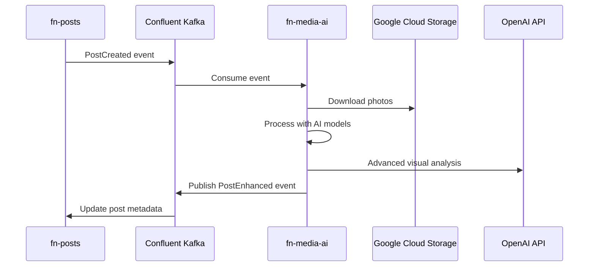

# FN Media AI - Lost & Found Photo Enhancement Service

**AI-powered photo analysis that transforms Lost & Found posts into rich, searchable metadata through computer vision and machine learning.**

## Overview

The FN Media AI service is a critical component of the Findly Now Lost & Found ecosystem. It processes uploaded photos using advanced AI models to automatically extract meaningful metadata, generate descriptive tags, and enhance post discoverability - dramatically improving the chances of reuniting people with their lost items.

## Core Mission

Transform photo-based Lost & Found reports from manual text descriptions to **intelligent, AI-powered discovery** through automated visual analysis.

**Business Impact:**
- 🔍 **Enhanced Discovery**: AI-generated tags make items easier to find
- 🚀 **Improved Matching**: Computer vision identifies visual similarities
- ⚡ **Faster Reunification**: Rich metadata enables intelligent search
- 🎯 **Higher Success Rates**: Better descriptions lead to more successful matches

## Architecture

This service follows **Domain-Driven Design (DDD)** principles with clean architecture:

```
src/fn_media_ai/
├── domain/           # Business logic & entities
│   ├── entities/     # PhotoAnalysis, ObjectDetection
│   ├── aggregates/   # PhotoAnalysisAggregate
│   ├── value_objects/# Confidence, BoundingBox, Tags
│   └── services/     # AIModelPipeline, ConfidenceEvaluator
├── application/      # Use cases & orchestration
│   ├── services/     # ProcessPhotoService
│   ├── commands/     # ProcessPhotoCommand
│   └── event_handlers/ # PostCreatedEventHandler
├── infrastructure/   # External integrations
│   ├── adapters/     # OpenAI, Hugging Face, GCS
│   ├── repositories/ # PhotoAnalysisRepository
│   └── clients/      # HTTP clients
└── web/             # FastAPI endpoints
    ├── controllers/  # REST API controllers
    └── middleware/   # Authentication, logging
```

## Key Features

### 🤖 Multi-Model AI Pipeline

- **Object Detection**: YOLO models identify items, brands, accessories
- **Scene Classification**: ResNet/EfficientNet detect location context
- **OCR Text Extraction**: Tesseract/EasyOCR extract visible text, serial numbers
- **Location Inference**: GPT-4 Vision provides landmark detection and context
- **Smart Description**: AI-generated enhanced descriptions

### 🎯 Confidence-Based Enhancement

All AI predictions include confidence scores with intelligent thresholding:

- **Auto-enhance** (>85%): Automatically update post metadata
- **Suggest tags** (>70%): Recommend tags for user approval
- **Human review** (>50%): Flag for manual verification
- **Discard** (<30%): Ignore low-confidence results

### ⚡ Event-Driven Processing

- Consumes `post.created` events from Kafka
- Processes photos asynchronously (2-10 seconds per photo set)
- Publishes `post.enhanced` events with enriched metadata
- Non-blocking: Users continue using platform while AI processes

### 🏗️ Production-Ready Infrastructure

- **Horizontal Scaling**: Stateless design enables easy replication
- **Model Optimization**: Quantization, batching, optimized inference
- **Caching Strategy**: Redis for AI results and model weights
- **Health Monitoring**: Comprehensive health checks and metrics

## Technology Stack

### Core Framework
- **FastAPI + Uvicorn**: Async web server with automatic OpenAPI docs
- **Pydantic**: Type validation and settings management

### AI/ML Libraries
- **PyTorch + Transformers**: Deep learning and Hugging Face models
- **OpenAI**: GPT-4 Vision API for advanced visual reasoning
- **OpenCV + Pillow**: Computer vision and image processing
- **Ultralytics (YOLO)**: State-of-the-art object detection
- **Tesseract + EasyOCR**: Optical character recognition

### Infrastructure
- **Confluent Kafka**: Event streaming and processing
- **Google Cloud Storage**: Photo access and storage
- **Redis**: Model caching and result storage
- **Prometheus**: Metrics and monitoring

## Quick Start

### Prerequisites

- Python 3.11+
- Redis server
- Google Cloud Storage access
- OpenAI API key
- Confluent Cloud Kafka access

### Installation

```bash
# Clone repository
git clone https://github.com/findly-now/fn-media-ai.git
cd fn-media-ai

# Create virtual environment
python -m venv .venv
source .venv/bin/activate  # On Windows: .venv\Scripts\activate

# Install dependencies
pip install -e ".[dev]"

# Install pre-commit hooks
pre-commit install
```

### Configuration

```bash
# Copy environment template
cp .env.example .env

# Edit .env with your credentials
vim .env
```

### Development

```bash
# Start Redis (if not running)
redis-server

# Run the service
uvicorn fn_media_ai.main:app --reload --host 0.0.0.0 --port 8000

# View API documentation
open http://localhost:8000/docs
```

### Testing

```bash
# Run E2E tests
pytest tests/e2e/ -v

# Run with coverage
pytest tests/e2e/ --cov=src/fn_media_ai --cov-report=html

# View coverage report
open htmlcov/index.html
```

## API Endpoints

### Health & Monitoring
- `GET /health` - Service health status
- `GET /metrics` - Prometheus metrics

### Photo Processing
- `POST /api/v1/photos/analyze` - Analyze single photo
- `POST /api/v1/posts/enhance` - Process post with multiple photos

### Model Management
- `GET /api/v1/models/status` - Model loading status
- `POST /api/v1/models/reload` - Reload AI models

## Event Processing Flow



## AI Processing Pipeline

```python
async def process_photo(photo_url: str) -> EnhancedMetadata:
    # Download and preprocess
    image = await download_photo(photo_url)

    # Parallel AI processing
    objects = await detect_objects(image)      # YOLO
    scene = await classify_scene(image)        # ResNet
    text = await extract_text(image)          # OCR
    location = await infer_location(image)     # GPT-4V

    # Combine results with confidence scoring
    return combine_analysis(objects, scene, text, location)
```

## Performance Targets

- **Processing Latency**: <5 seconds per photo (target: <3s)
- **Throughput**: 100+ concurrent photo analyses
- **Accuracy**: >85% object detection accuracy for common items
- **Availability**: 99.5% uptime (AI failures don't impact core platform)

## Development Guidelines

### Domain-Driven Design
- Keep business logic in domain entities and services
- Use aggregates to maintain consistency boundaries
- Infrastructure adapters implement domain interfaces
- Domain events for all state changes

### Testing Strategy
- **E2E tests only** - all tests use real adapters
- Test complete workflows with actual cloud services
- Include confidence scoring and error handling
- Test model fallback scenarios

### Code Quality
- **Type hints required** - full mypy compliance
- **Black formatting** - consistent code style
- **Minimal comments** - focus on complex business rules
- **Async/await** - for all I/O operations

## Monitoring & Observability

### Health Checks
```bash
curl http://localhost:8000/health
```

### Metrics
- Processing latency per model
- Confidence score distributions
- Error rates by photo type
- Cache hit/miss ratios

### Logging
Structured JSON logging with correlation IDs for request tracing.

## Security

- Service account authentication for GCS access
- API key rotation for OpenAI
- Input validation for all photo uploads
- Rate limiting for expensive AI operations

## Deployment

### Docker
```bash
# Build image
docker build -t fn-media-ai .

# Run container
docker run -p 8000:8000 --env-file .env fn-media-ai
```

### Kubernetes
See `scripts/deployment/` for Kubernetes manifests and Helm charts.

## Contributing

1. Fork the repository
2. Create a feature branch
3. Add E2E tests for new functionality
4. Ensure all tests pass and code is formatted
5. Submit a pull request

## License

MIT License - see [LICENSE](LICENSE) for details.

## Related Services

- **fn-posts**: Core Lost & Found post management
- **fn-notifications**: Multi-channel notification delivery
- **fn-docs**: Architecture documentation and product vision

---

**Remember**: This is not a generic computer vision service - it's specifically designed for Lost & Found item identification and enhancement. All features and optimizations focus on improving reunification success rates.